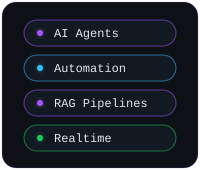
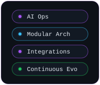

 

 &nbsp;  &nbsp; 

  

  
  &nbsp;
  

 

  
  &nbsp;
  
  &nbsp;
  

 

  

  

 

  

<!-- EDITA: añade aquí badges "Ver demo" de más proyectos cuando tengan URL pública; el board vive en assets/projects.svg -->

